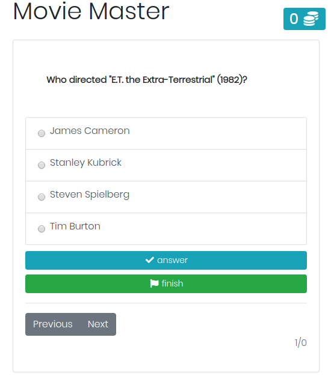

# Movie Master

Movie Master is a quiz that uses opendb.com api



## Getting Started

These instructions will get you a copy of the project up and running on your local machine for development and testing purposes. See deployment for notes on how to deploy the project on a live system.

### Prerequisites

What things you need to install the software and how to install them

```
Give examples
```


## Running the tests

Explain how to run the automated tests for this system

## Built With


* HTML
* Javascript
* CSS

## License

This project is licensed under the MIT License - see the [LICENSE.md](LICENSE.md) file for details